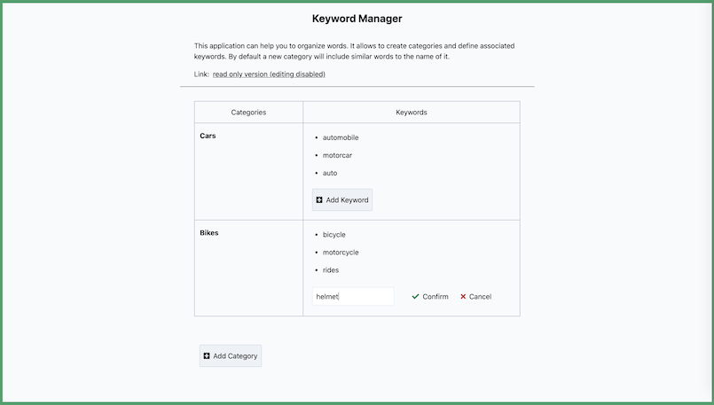

# Example Keyword Manager

This repository contains a web application that can help with organizing words. Its based on
[React](https://reactjs.org/) and uses [GraphQL](https://graphql.org/) (via
[Apollo](https://www.apollographql.com/)) to connect the UI frontend with the data backend.



## Features

- being able to create and delete `categories`
- being able to add and remove `keywords` associated with a `category`
- pre-fill new categories with similar meaning words (powered by [Datamuse](https://www.datamuse.com/))
- having a readonly mode without editing controls

## Getting Started

I.) Using Node.js:

Ensure that that [Node.js](https://nodejs.org/) and [yarn](https://classic.yarnpkg.com/) are locally
available (e.g. using [`nvm use`](https://github.com/nvm-sh/nvm)) to use the following:

```sh
yarn start
```

II.) Using Docker:

Execute [the shell script](./bin/start-production.sh) or run the follow commands in the terminal:

```sh
# build image
docker build --no-cache -t example-keyword-manager:latest .

# run container
docker run --rm -it -p 10000:10000 example-keyword-manager:latest
```

## Overview

At the beginning common tools were configured ([EditorConfig](https://editorconfig.org/),
[ESlint](https://eslint.org/), [prettier](https://prettier.io/)) to provide a consistent developer
experience. Moreover [TypeScript](https://www.typescriptlang.org/) and [Babel](https://babeljs.io/)
are leveraged to assist with modern features.

While separating frontend and backend services can often be helpful, in this case a single code
base is used to run both. To simplify the handling [Next.js](https://nextjs.org/) is used by
defining the resources in `src/pages`. For now there is only the [index page](./src/pages/index.tsx)
and the [graphql endpoint](./src/pages/api/graphql/index.ts).

Styling at the frontend is done through [Tailwind CSS](https://tailwindcss.com/). Even though the
definitions are encouraging a mobile first design, this project was more optimized for larger
screens. Additionally it takes advantage of pointer devices to hide unused controls until they're
focused by the user. The network communication with the API is done via an [Apollo client](https://www.apollographql.com/docs/react/). On the other side the backend follows a code-first approach to
define GraphQL type definitions and resolvers for the schemas using [GraphQL Nexus](https://nexus.js.org/). So far all data are kept in memory rather than a dedicated database.

To ensure the implementations work as expected unit & integration tests were defined using
[jest](https://jestjs.io/) and [react testing library](https://testing-library.com/docs/react-testing-library/intro). By focusing on the way that the software is used correct rendering output, action behavior and side effects can be covered.

## Structure

```
|
|- @types
|- bin
|- docs
|- scripts
|- src
|-- backend
|--- models
|--- services
|-- frontend
|--- assets
|--- components
|--- design
|--- graphql
|--- widgets
|-- pages
|-- types.ts
|- test
|-- mocks
```

## Possible Improvements

- extend keyword interactions (e.g. rename)
- support localization
- enhance accessibility by using
  [react-aria](https://react-spectrum.adobe.com/react-aria/index.html) hooks
- persist data not just in memory but a backup storage
- [generate static GraphQL schema and type artifacts](https://nexus.js.org/docs/api-makeschema#shouldgenerateartifacts-outputs-typegenautoconfig) to ensure clients are in sync
- set up [Storybook](https://storybook.js.org/) for better isolated development
- use a more lightweight GraphQL client like
[urlq](https://formidable.com/open-source/urql/) or even fetchers such as [react-query](https://react-query.tanstack.com/)/[swr](https://swr.vercel.app/)
- add further integration and end-to-end tests of either [Cypress](https://www.cypress.io/) of [Playwright](https://playwright.dev/)/[Puppeteer](https://pptr.dev/)
